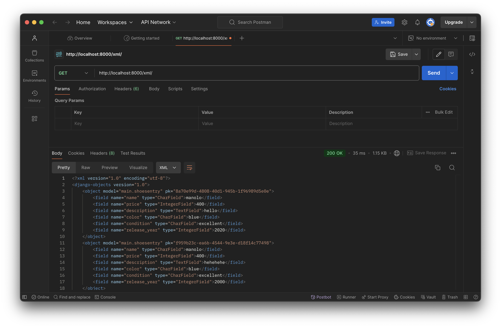
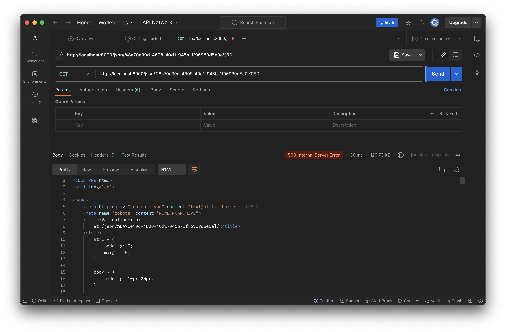
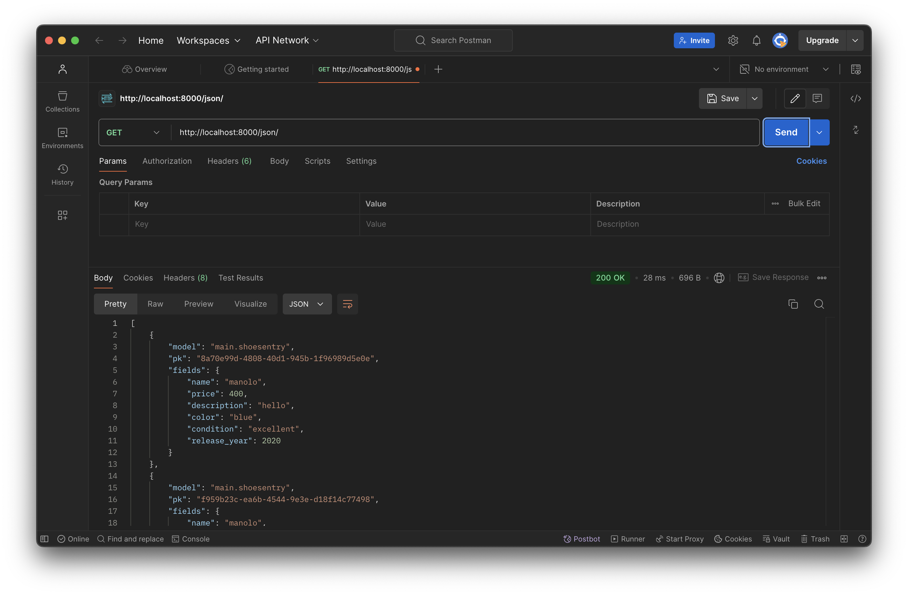

# Sole de Luxe
Link applikasi PWS: http://aliya-zahira-soledeluxe.pbp.cs.ui.ac.id

<details>
<Summary><b>Tugas 2</b></summary>

# Tugas 2: Implementasi Model-View-Template (MVT) pada Django
Link applikasi PWS: http://aliya-zahira-soledeluxe.pbp.cs.ui.ac.id

## Langkah-langkah pembuatan project
Berikut adalah beberapa langkah-langkah yang saya lakukan untuk membuat project ini
- Melakukan instalasi python, django, dan github.
- Mengaktifkan virtual environment
- Menambahkan beberapa dependencies pada requirements dan juga melakukan instalasi requirements itu sendiri serta membuat projek Django
- Melakukan konfigurasi server dan menjalankan server itu sendiri lalu menonaktifkan server dan virtual environment
- Mengunggah projek ke github dengan melakukan command push
- Membuat project dan aplikasi dengan startapp serta mendaftarkan applikasi main ke dalam project
- Mengganti isian dari berkas models.py dengan atribut yang sesuai, setelah itu melakukan migrasi model
- Menambahkan data-data yang diperlukan pada berkas views.py
- Membuat berkas main.html yang berisi kustomisasi tampilan sesuai yang diinginkan, lalu membuat konfigurasi routing URL
- Melakukan pembaruan/update pada github dan melakukan deployment hasil ke PWS

## Buatlah bagan yang berisi request client ke web aplikasi berbasis Django beserta responnya dan jelaskan pada bagan tersebut kaitan antara urls.py, views.py, models.py, dan berkas html.

- urls.py: untuk menerima request yang sesuai dan menghubungkan pola request tersebut ke views
- template: menyusun tampilan akhir dari aplikasi
- views.py: mengelola logika dari aplikasi
- models.py: berisi skema yang telah dimodifikasi tentang data

## Jelaskan fungsi git dalam pengembangan perangkat lunak!
Git membantu programmer melacak perubahan basis kode, sehingga dapat memudahkan programmer dalam mengelola dan berkolaborasi dalam pembuatan project. Git membantu programmer untuk mengerjakan project yang sama secara bersamaan. Selain itu, git juga sangat membantu dalam pengembangan program karena menyediakan riwayat perubahan dan memungkinkan programmer uuntuk melakukan pengembalian project ke versi sebelumnya.

## Menurut Anda, dari semua framework yang ada, mengapa framework Django dijadikan permulaan pembelajaran pengembangan perangkat lunak?
Django dipilih karena kelengkapan fitur yang dimiliki karena Django telah menyediakan banyak fitur bawaan yang dapat memudahkan pengembangan aplikasi. Selanjutnya, Django memiliki dokumentasi yang lengkap sehingga dapat membantu programmer pemula untuk mengatasi masalah dan belajar lebih cepat.

## Mengapa model pada Django disebut sebagai ORM?
Model pada Django disebut ORM (Object-Relational Mapping) karena ORM menghubungkan objek Python dengan tabel dalam database relasional. Dengan ORM, pengembang dapat berinteraksi dengan database menggunakan kode Python, menghindari penulisan SQL secara langsung, dan memungkinkan pengelolaan data yang efisien melalui pemetaan objek ke format tabel.

</details>

<details>
<Summary><b>Tugas 3</b></summary>

# Tugas 3
## Jelaskan mengapa kita memerlukan data delivery dalam pengimplementasian sebuah platform?
Data delivery sangat penting dalam implementasi sebuah platform karena membantu meningkatkan efisiensi dengan memastikan bahwa data yang diperlukan oleh pengguna atau aplikasi tersedia tepat waktu dan dalam format yang sesuai. Selain itu, proses data delivery juga berkontribusi pada peningkatan kecepatan platform dan memastikan bahwa data yang disajikan akurat serta konsisten. Data delivery juga mendukung skalabilitas dengan memungkinkan platform menangani volume data yang meningkat seiring waktu, serta memastikan bahwa platform responsif terhadap perubahan dan pembaruan data secara real-time. Selain itu, aspek keamanan dalam data delivery melibatkan perlindungan data selama transmisi, menjaga data tetap aman dari akses yang tidak sah.

## Menurutmu, mana yang lebih baik antara XML dan JSON? Mengapa JSON lebih populer dibandingkan XML?
Saya lebih memilih JSON karena karena formatnya yang lebih sederhana dan ringkas sehingga memudahkan penulisan, pembacaan, dan pemahaman data. Selain itu, JSON memiliki ukuran data yang lebih kecil dan parsing yang lebih cepat, karena itulah JSON meningkatkan efisiensi dan kinerja aplikasi, terutama di lingkungan web. Beberapa alasan diatas juga menyebabkan JSON lebih popular penggunaannya dibanding XML.

## Jelaskan fungsi dari method is_valid() pada form Django dan mengapa kita membutuhkan method tersebut?
Method `is_valid()` pada form Django berfungsi untuk memeriksa apakah data yang dikirimkan melalui form memenuhi semua kriteria validasi yang telah ditentukan. Dengan menggunakan `is_valid()`, kita dapat memastikan bahwa data valid sebelum melanjutkan ke langkah berikutnya, seperti menyimpan data ke database atau memproses informasi lebih lanjut. Method ini juga menangani dan menyimpan pesan kesalahan jika ada input yang tidak valid, sehingga memudahkan kita untuk memberikan umpan balik yang relevan kepada pengguna.

## Mengapa kita membutuhkan csrf_token saat membuat form di Django? Apa yang dapat terjadi jika kita tidak menambahkan csrf_token pada form Django? Bagaimana hal tersebut dapat dimanfaatkan oleh penyerang?
CSRF (Cross-Site Request Forgery) token diperlukan dalam form Django untuk melindungi situs web dari serangan di mana penyerang mencoba mengirimkan permintaan palsu atas nama pengguna tanpa izin. Jika `csrf_token` tidak ditambahkan pada form, penyerang bisa membuat form palsu di situs lain yang mengirimkan data berbahaya ke situs web kita. Ini bisa menyebabkan tindakan yang tidak diinginkan, seperti perubahan data pengguna atau akses yang tidak sah. Dengan `csrf_token`, Django memastikan bahwa hanya permintaan yang sah dan berasal dari pengguna yang sebenarnya yang akan diproses.

## Jelaskan bagaimana cara kamu mengimplementasikan checklist di atas secara step-by-step (bukan hanya sekadar mengikuti tutorial).
### 1. Membuat input form untuk menambahkan objek model pada app sebelumnya.
Langkah pertama yang saya lakukan untuk membuat input form adalah dengan membuat berkas baru bernama forms.py dan meng import form tersebut dalam berkas views.py. Selanjutnya, saya membuat fungsi khusus yang akan menerima request entry dan meng import nya pada berkas urls.py dan membuat berkas HTML baru yang berisi entry dari form tersebut.

### 2. Tambahkan 4 fungsi views baru untuk melihat objek yang sudah ditambahkan dalam format XML, JSON, XML by ID, dan JSON by ID.
Untuk data dalam format XML dan JSON, pertama-tama saya menambahkan impor `HttpResponse` dan `serializers` pada berkas `views.py`. Kemudian, saya membuat fungsi baru yang menerima parameter `request` dan mengembalikan data dalam format XML menggunakan `HttpResponse`. Fungsi ini akan membangun data XML dan mengembalikannya dengan tipe konten yang sesuai. Selanjutnya, saya membuat fungsi serupa yang juga menerima parameter `request`, tetapi mengembalikan data dalam format JSON. Fungsi ini akan menggunakan `HttpResponse` dengan tipe konten `application/json`. Terakhir, saua membuat dua fungsi tambahan untuk menangani data dengan ID tertentu. Fungsi-fungsi ini akan menyimpan hasil query berdasarkan ID dan mengembalikannya dalam format XML atau JSON dengan menggunakan `HttpResponse`, serta mengatur tipe konten menjadi `application/xml` atau `application/json`, sesuai dengan format yang diminta.

### 3. Membuat routing URL untuk masing-masing views yang telah ditambahkan pada poin 2.
Pertama, tambahkan impor untuk fungsi-fungsi yang telah dibuat sebelumnya, yaitu `show_xml`, `show_json`, `show_xml_by_id`, dan `show_json_by_id`, ke dalam berkas `views.py`. Setelah itu, tambahkan path URL untuk keempat fungsi tersebut ke dalam berkas `urls.py`. Setelah melakukan import beberapa function tadi, maka function tersebut dapat diakses pada rute yang sesuai di aplikasi Django dan memungkinkan pengguna untuk melihat data dalam format XML dan JSON serta mengakses objek berdasarkan ID melalui URL yang telah ditentukan.

## Mengakses keempat URL di poin 2 menggunakan Postman, membuat screenshot dari hasil akses URL pada Postman, dan menambahkannya ke dalam README.md.
### URL XML

### URL XML by ID

### URL JSON

### URL JSON by ID


</details>

<details>
<Summary><b>Tugas 4</b></summary>

# Tugas 4
## 1. Apa perbedaan antara HttpResponseRedirect() dan redirect()
### - HttpResponseRedirect()
**HttpResponseRedirect()** adalah turunan dari **HttpResponse** yang menghasilkan respons pengalihan ke klien. Fungsinya adalahh untuk mengarahkan pengguna ke URL spesifik dengan mengirim objek **HttpResponse** yang berisi kode status HTTP 302
### - redirect()
**redirect()** merupakan fungsi shortcut yang lebih praktis dan fleksibel untuk mengelola pengalihan. Fungsi ini memudahkan pengalihan tanpa perlu secara manual menentukan URL, terutama saat menggunakan nama view atau objek.

## 2. Jelaskan cara kerja penghubungan model Product dengan User!
Penghubungan model **ShoeEntry** dengan model **User** dilakukan menggunakan field **ForeignKey**. Field **user** mengacu pada model **User** dari Django yang memungkinkan setiap entry sepatu dikaitkan dengan pengguna yang terdaftar. Dengan argumen **on_delete_models.CASCADE**, apabila pengguna dihapus, maka semua entry sepatu yang berkaitan dengan pengguna tersebut juga akan terhapus secara otomatis. Adanya relasi ini memungkinkan pengguna untuk mengelola data mereka.

## 3. Apa perbedaan antara authentication dan authorization, apakah yang dilakukan saat pengguna login? Jelaskan bagaimana Django mengimplementasikan kedua konsep tersebut.
### - Authentication
Authentication merupakan proses verifikasi identitas pengguna. Proses ini akan memeriksa validitas kredensial pengguna seperti username dan password. 
### - Authorization
Authorization merupakan proses yang terjadi setelah penggun berhasil melalui tahap authentication. Authorization adalah proses yang mengatur hak akses pengguna terhadap suatu aplikasi. Authorization menentukan apa yang dapat dilakukan oleh pengguna setelah melewati tahap authentication. Contohnya, tahap selanjutnya setelah authentication pada web Sole de Luxe adalah user dapat menambahkan shoes entry beserta atributnya. 

## 4. Bagaimana Django mengingat pengguna yang telah login? Jelaskan kegunaan lain dari cookies dan apakah semua cookies aman digunakan?
Django mengingat pengguna yang telah login menggunakan session dan cookies, di mana session ID disimpan dalam cookie di browser untuk mengaitkan pengguna dengan data sesi mereka di server. Selain autentikasi, cookies juga digunakan untuk menyimpan preferensi pengguna, melacak aktivitas, dan meningkatkan keamanan. Namun, tidak semua cookies aman. Untuk menjaga keamanan, cookies sebaiknya hanya dikirim melalui HTTPS (Secure), tidak diakses oleh JavaScript (HttpOnly), dibatasi untuk domain yang sama (SameSite), dan data sensitif dienkripsi. Praktik ini memastikan keamanan dan integritas sesi pengguna di Django.

## 5. Jelaskan bagaimana cara kamu mengimplementasikan checklist di atas secara step-by-step (bukan hanya sekadar mengikuti tutorial).
### 1. Membuat form untuk registrasi
Langkah pertama yang saya lakukan akan membuat form registrasi. Pada tahap ini menambahkan **UserCreationForm** dan **messages** untuk memudahkan pembuatan formulir pendaftaran pengguna. 
### 2. Membuat form login, logout, dan merestriksi akses halaman main
Untuk membuat form login, saya menambahkan **authenticate**, **login** dan **AuthenticationForm** pada views serta mendefinisikan fungsi **login_user**. Untuk membuat form logout, saya menambahkan sebuah fungsi bernama **logout_user** untuk menghapus sesi pengguna. Selanjutnya saya menambahkan **@login_required** untuk membatasi akses pengguna ke halaman main, sehingga login diperlukan untuk mengaksesnya.
### 3. Menambahkan cookies
Saya menggunakan cookie untuk menyimpan waktu login terakhir dengan **response.set_cookie('last_login')** pada fungsi **login_user** dan menambahkan **response.delete_cookie('last_login')** pada **logout_user** untuk menghapus cookie setelah pengguna logout.
### 4. Menghubungan model dengan User
Pada tahap ini saya menambahkan field **user = models.ForeignKey(User, on_delete=models.CASCADE)** pada model **ShoesEntry** di models.py. Setelah itu, saya menetapkan **shoes_entry.user = request.user** di **create_shoes_entry** dan filter entri di **show_main** dengan **ShoesEntry.objects.filter(user=request.user)**. Lalu, saya melakukan migrations terhadap model dan mengatur variabel **DEBUG** pada settings.
### 4. Membuat dummy data
Sebelum melakukan migration, saya sudah membuat satu user. Setelah itu, saya mendefinisikan satu akun user lagi beserta 3 dummy data di masing-masing akun. 

</details>

<details>
<Summary><b>Tugas 5</b></summary>

# Tugas 5

## 1. Jika terdapat beberapa CSS selector untuk suatu elemen HTML, jelaskan urutan prioritas pengambilan CSS selector tersebut!
Inline Styles: Memiliki prioritas tertinggi karena diterapkan langsung pada elemen HTML.
ID Selectors: Menggunakan ID elemen, ditandai dengan simbol #, memiliki prioritas setelah inline styles.
Class, Attribute, dan Pseudo-Class Selectors: Prioritasnya berada di bawah ID selectors, contohnya seperti .classname, [type="text"], dan :hover.
Element dan Pseudo-Element Selectors: Memiliki prioritas terendah, misalnya untuk elemen HTML seperti div, h1, atau p.
Aturan !important: Mengabaikan semua aturan lain dan langsung diterapkan meskipun ada selector dengan prioritas lebih tinggi.

## 2. Mengapa responsive design menjadi konsep yang penting dalam pengembangan aplikasi web? Berikan contoh aplikasi yang sudah dan belum menerapkan responsive design!
Karena programmer tidak mungkin bisa memprediksi perangkat apa yang akan digunakan oleh pengguna untuk mengakses website. Oleh karena itu, penting untuk menyesuaikan desain agar tampilan website tetap optimal di berbagai perangkat dengan ukuran layar yang beragam, seperti ponsel, tablet, laptop, atau komputer desktop. Tanpa responsive design, tampilan website bisa menjadi tidak rapi dan sulit digunakan pada perangkat yang berbeda.

Contoh aplikasi yang sudah menerapkan responsive design untuk desktop dan tampilan mobile adalah Tokopedia, sementara aplikasi yang belum menerapkan responsive design adalah elearning.universityX.edu. 

## 3. Jelaskan perbedaan antara margin, border, dan padding, serta cara untuk mengimplementasikan ketiga hal tersebut!
Margin, border, dan padding adalah tiga properti CSS yang digunakan untuk mengatur ruang di sekitar elemen HTML, dan masing-masing memiliki fungsi yang berbeda:

- Margin: Adalah ruang di luar elemen, yang memisahkan elemen dari elemen lainnya di sekitar Margin tidak mempengaruhi ukuran elemen itu sendiri.
Cara implementasi:
```css
div {
    margin: 20px; /* Menambahkan margin 20px di sekitar elemen */
}
```

- Border: Adalah garis yang mengelilingi elemen, dan berada di antara margin dan padding. Border memisahkan konten elemen dari margin dan menambah visual boundary pada elemen.
Cara implementasi:
```css
div {
    border: 2px solid black; /* Membuat border dengan ketebalan 2px, tipe solid, dan warna hitam */
}
```

- Padding: Adalah ruang di dalam elemen, antara konten elemen dan border. Padding menambah jarak antara isi elemen (seperti teks atau gambar) dengan tepi elemen.
Cara implementasi:
```css
div {
    padding: 15px; /* Menambahkan jarak 15px antara konten dan border elemen */
}
```

## 4. Jelaskan konsep flex box dan grid layout beserta kegunaannya!
Flexbox adalah Model tata letak satu dimensi yang mengatur elemen dalam satu baris atau kolom.
Kegunaan:
- Menyusun elemen secara fleksibel.
- Memudahkan responsivitas dan penyesuaian ukuran.
- Mengatur penyelarasan dan distribusi ruang antar elemen.

Grid Layout adalah model tata letak dua dimensi yang memungkinkan pengaturan elemen dalam baris dan kolom secara bersamaan.
Kegunaan:
- Mengatur tata letak kompleks dengan lebih mudah.
- Membagi halaman menjadi grid yang dapat disesuaikan.
- Memungkinkan pengaturan posisi elemen di dalam grid dengan kontrol yang lebih baik.
- Kedua metode ini sangat berguna untuk menciptakan tata letak yang responsif dan terorganisir dalam desain web.

## 5. Jelaskan bagaimana cara kamu mengimplementasikan checklist di atas secara step-by-step (bukan hanya sekadar mengikuti tutorial)!
- Pertama untuk mengimplementasikan edit dan delete, saya lakuka dengan membuat function edit_shoes dan delete_shoes di file views lalu melakukan routing pada url path
- Selanjutnya untuk kustomisasi design saya mengintegrasikan Tailwind ke dalam proyek ini, saya melakukan modifikasi pada file base.html agar dapat menghubungkan template Django dengan Tailwind serta menyesuaikan tampilan untuk berbagai perangkat (mobile). Lalu, saya melakukan penyesuaian pada setiap template sesuai dengan tema aplikasi yang saya inginkan. Setiap produk dalam daftar produk akan ditampilkan di shoes_display_card.html beserta model yang relevan. Pada setiap kartu produk, saya menambahkan tombol untuk mengedit dan menghapus entri di bagian bawah kartu agar pengguna lebih mudah melakukan penyesuaian. Terakhir, untuk menambahkan navigasi bar pada website, saya membuat file baru dengan nama navbar.html. Desain navigasi bar dibagi menjadi dua bagian, yaitu untuk desktop dan mobile (dengan tombol burger), lalu saya menyertakan navbar ini pada semua template halaman yang diinginkan.
</details>

<details>

# Tugas 6

## 1. Jelaskan manfaat dari penggunaan JavaScript dalam pengembangan aplikasi web!
JavaScript memiliki beberapa manfaat dalam pengembangan aplikasi web, contohnya dalam menambahkan interaktivitas dan efek visual, memproses data di sisi klien untuk mengurangi beban server, serta mendukung komunikasi asinkron dengan server menggunakan AJAX tanpa memuat ulang halaman. Selain itu, JavaScript memungkinkan pengembangan antarmuka pengguna yang dinamis melalui framework seperti React dan Angular, serta memfasilitasi akses ke berbagai API untuk integrasi fungsionalitas tambahan.

## 2. Jelaskan fungsi dari penggunaan await ketika kita menggunakan fetch()! Apa yang akan terjadi jika kita tidak menggunakan await?
Fungsi dari penggunaan `await` saat menggunakan `fetch()` adalah untuk menunggu hasil dari permintaan HTTP sebelum melanjutkan eksekusi kode. Dengan `await`, eksekusi akan terhenti sampai `fetch()` menyelesaikan permintaannya dan mengembalikan respons. Ini membuat kode lebih mudah dibaca dan memungkinkan penanganan hasil dengan cara yang lebih terstruktur.

Jika kita tidak menggunakan `await`, `fetch()` akan mengembalikan sebuah *Promise* segera setelah dipanggil, tanpa menunggu respons dari server. Ini berarti eksekusi kode akan terus berjalan, dan kita mungkin mencoba mengakses data dari respons yang belum ada, yang dapat menyebabkan kesalahan atau perilaku yang tidak diinginkan. Selain itu, kita perlu menangani *Promise* secara eksplisit menggunakan `.then()` dan `.catch()` untuk mengelola hasil dan kesalahan.

## 3. Mengapa kita perlu menggunakan decorator csrf_exempt pada view yang akan digunakan untuk AJAX POST?
Kita perlu menggunakan decorator @csrf_exempt pada view yang akan digunakan untuk AJAX POST karena:
- Keamanan CSRF: Secara default, Django melindungi aplikasi dari serangan Cross-Site Request Forgery (CSRF) dengan memerlukan token CSRF pada setiap permintaan POST. Token ini harus disertakan dalam permintaan untuk memverifikasi bahwa permintaan tersebut berasal dari pengguna yang sah.
- Permintaan AJAX: Saat menggunakan AJAX, seringkali kita tidak mengirimkan token CSRF secara otomatis. Jika kita tidak menggunakan decorator @csrf_exempt, Django akan menolak permintaan POST yang tidak menyertakan token CSRF yang valid, sehingga mengakibatkan kesalahan 403 Forbidden.
- Penggunaan yang Aman: Dengan menggunakan @csrf_exempt, kita mengizinkan view tertentu untuk menerima permintaan POST tanpa memerlukan token CSRF, tetapi harus diingat bahwa ini dapat mengurangi keamanan. Oleh karena itu, sebaiknya digunakan dengan hati-hati, dan hanya pada endpoint yang dianggap aman.

## 4. Pada tutorial PBP minggu ini, pembersihan data input pengguna dilakukan di belakang (backend) juga. Mengapa hal tersebut tidak dilakukan di frontend saja?
Pembersihan data input pengguna sebaiknya dilakukan di backend karena beberapa alasan penting. Pertama, keamanan menjadi faktor utama, karena data dari frontend dapat dimanipulasi oleh pengguna yang tidak bertanggung jawab, sehingga pembersihan di backend mencegah data berbahaya masuk ke server. Selain itu, backend mampu menerapkan validasi yang lebih kompleks dan ketat, menjaga integritas data dengan memastikan bahwa data yang disimpan di database memenuhi kriteria tertentu. Pembersihan di backend juga mendukung berbagai klien, sehingga memastikan semua data, terlepas dari sumbernya, diproses secara konsisten. Terakhir, backend dapat memberikan umpan balik yang lebih akurat tentang kesalahan dan cara memperbaikinya, meningkatkan pengalaman pengguna secara keseluruhan.

## 5. Jelaskan bagaimana cara kamu mengimplementasikan checklist di atas secara step-by-step (bukan hanya sekadar mengikuti tutorial)!
Pertama, saya membuat permintaan AJAX GET untuk mengambil data produk dari pengguna yang sudah login, lalu menampilkannya dalam kartu produk yang di-render secara dinamis di halaman utama. Saya membuat fungsi untuk menambahkan produk di views dan menyesuaikan main.html agar sesuai dengan tampilan kartu, sementara card.html tidak digunakan lagi.

Selanjutnya, saya menambahkan tombol yang membuka modal berisi formulir untuk menambah produk. Setelah formulir disubmit menggunakan AJAX POST, modal akan tertutup otomatis, formulir di-reset, dan halaman akan menampilkan data terbaru tanpa reload. Untuk keamanan, saya menggunakan token CSRF pada setiap permintaan POST untuk mencegah serangan CSRF. Saya juga menambahkan jalur di urls.py untuk mengarahkan permintaan POST ke view yang menyimpan data produk ke dalam database. Setelah formulir berhasil disubmit, modal akan tertutup, formulir di-reset, dan halaman diperbarui tanpa reload. Pesan "this input cannot be blank" hanya muncul untuk input non-AJAX dengan kode  dan belum berlaku untuk input AJAX, yang memerlukan pemahaman JavaScript yang lebih mendalam.
</details>