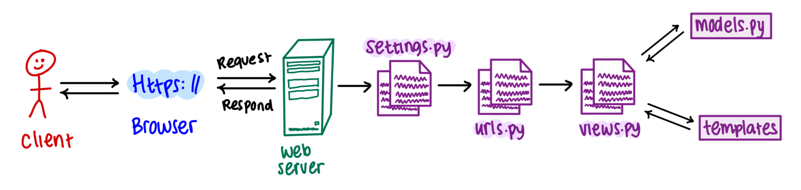

# Tugas 2: Implementasi Model-View-Template (MVT) pada Django
Link applikasi PWS: http://aliya-zahira-soledeluxe.pbp.cs.ui.ac.id

## Langkah-langkah pembuatan project
Berikut adalah beberapa langkah-langkah yang saya lakukan untuk membuat project ini
- Melakukan instalasi python, django, dan github.
- Mengaktifkan virtual environment
- Menambahkan beberapa dependencies pada requirements dan juga melakukan instalasi requirements itu sendiri serta membuat projek Django
- Melakukan konfigurasi server dan menjalankan server itu sendiri lalu menonaktifkan server dan virtual environment
- Mengunggah projek ke github dengan melakukan command push
- Membuat project dan aplikasi dengan startapp serta mendaftarkan applikasi main ke dalam project
- Mengganti isian dari berkas models.py dengan atribut yang sesuai, setelah itu melakukan migrasi model
- Menambahkan data-data yang diperlukan pada berkas views.py
- Membuat berkas main.html yang berisi kustomisasi tampilan sesuai yang diinginkan, lalu membuat konfigurasi routing URL
- Melakukan pembaruan/update pada github dan melakukan deployment hasil ke PWS

## Buatlah bagan yang berisi request client ke web aplikasi berbasis Django beserta responnya dan jelaskan pada bagan tersebut kaitan antara urls.py, views.py, models.py, dan berkas html.

- urls.py: untuk menerima request yang sesuai dan menghubungkan pola request tersebut ke views
- template: menyusun tampilan akhir dari aplikasi
- views.py: mengelola logika dari aplikasi
- models.py: berisi skema yang telah dimodifikasi tentang data

## Jelaskan fungsi git dalam pengembangan perangkat lunak!
Git membantu programmer melacak perubahan basis kode, sehingga dapat memudahkan programmer dalam mengelola dan berkolaborasi dalam pembuatan project. Git membantu programmer untuk mengerjakan project yang sama secara bersamaan. Selain itu, git juga sangat membantu dalam pengembangan program karena menyediakan riwayat perubahan dan memungkinkan programmer uuntuk melakukan pengembalian project ke versi sebelumnya.

## Menurut Anda, dari semua framework yang ada, mengapa framework Django dijadikan permulaan pembelajaran pengembangan perangkat lunak?
Django dipilih karena kelengkapan fitur yang dimiliki karena Django telah menyediakan banyak fitur bawaan yang dapat memudahkan pengembangan aplikasi. Selanjutnya, Django memiliki dokumentasi yang lengkap sehingga dapat membantu programmer pemula untuk mengatasi masalah dan belajar lebih cepat.

## Mengapa model pada Django disebut sebagai ORM?
Model pada Django disebut ORM (Object-Relational Mapping) karena ORM menghubungkan objek Python dengan tabel dalam database relasional. Dengan ORM, pengembang dapat berinteraksi dengan database menggunakan kode Python, menghindari penulisan SQL secara langsung, dan memungkinkan pengelolaan data yang efisien melalui pemetaan objek ke format tabel.

# Tugas 3
## Jelaskan mengapa kita memerlukan data delivery dalam pengimplementasian sebuah platform?
Data delivery sangat penting dalam implementasi sebuah platform karena membantu meningkatkan efisiensi dengan memastikan bahwa data yang diperlukan oleh pengguna atau aplikasi tersedia tepat waktu dan dalam format yang sesuai. Selain itu, proses data delivery juga berkontribusi pada peningkatan kecepatan platform dan memastikan bahwa data yang disajikan akurat serta konsisten. Data delivery juga mendukung skalabilitas dengan memungkinkan platform menangani volume data yang meningkat seiring waktu, serta memastikan bahwa platform responsif terhadap perubahan dan pembaruan data secara real-time. Selain itu, aspek keamanan dalam data delivery melibatkan perlindungan data selama transmisi, menjaga data tetap aman dari akses yang tidak sah.

## Menurutmu, mana yang lebih baik antara XML dan JSON? Mengapa JSON lebih populer dibandingkan XML?
Saya lebih memilih JSON karena karena formatnya yang lebih sederhana dan ringkas sehingga memudahkan penulisan, pembacaan, dan pemahaman data. Selain itu, JSON memiliki ukuran data yang lebih kecil dan parsing yang lebih cepat, karena itulah JSON meningkatkan efisiensi dan kinerja aplikasi, terutama di lingkungan web. Beberapa alasan diatas juga menyebabkan JSON lebih popular penggunaannya dibanding XML.

## Jelaskan fungsi dari method is_valid() pada form Django dan mengapa kita membutuhkan method tersebut?
Method `is_valid()` pada form Django berfungsi untuk memeriksa apakah data yang dikirimkan melalui form memenuhi semua kriteria validasi yang telah ditentukan. Dengan menggunakan `is_valid()`, kita dapat memastikan bahwa data valid sebelum melanjutkan ke langkah berikutnya, seperti menyimpan data ke database atau memproses informasi lebih lanjut. Method ini juga menangani dan menyimpan pesan kesalahan jika ada input yang tidak valid, sehingga memudahkan kita untuk memberikan umpan balik yang relevan kepada pengguna.

## Mengapa kita membutuhkan csrf_token saat membuat form di Django? Apa yang dapat terjadi jika kita tidak menambahkan csrf_token pada form Django? Bagaimana hal tersebut dapat dimanfaatkan oleh penyerang?
CSRF (Cross-Site Request Forgery) token diperlukan dalam form Django untuk melindungi situs web dari serangan di mana penyerang mencoba mengirimkan permintaan palsu atas nama pengguna tanpa izin. Jika `csrf_token` tidak ditambahkan pada form, penyerang bisa membuat form palsu di situs lain yang mengirimkan data berbahaya ke situs web kita. Ini bisa menyebabkan tindakan yang tidak diinginkan, seperti perubahan data pengguna atau akses yang tidak sah. Dengan `csrf_token`, Django memastikan bahwa hanya permintaan yang sah dan berasal dari pengguna yang sebenarnya yang akan diproses.

## Jelaskan bagaimana cara kamu mengimplementasikan checklist di atas secara step-by-step (bukan hanya sekadar mengikuti tutorial).
### 1. Membuat input form untuk menambahkan objek model pada app sebelumnya.
Langkah pertama yang saya lakukan untuk membuat input form adalah dengan membuat berkas baru bernama forms.py dan meng import form tersebut dalam berkas views.py. Selanjutnya, saya membuat fungsi khusus yang akan menerima request entry dan meng import nya pada berkas urls.py dan membuat berkas HTML baru yang berisi entry dari form tersebut.

### 2. Tambahkan 4 fungsi views baru untuk melihat objek yang sudah ditambahkan dalam format XML, JSON, XML by ID, dan JSON by ID.
Untuk data dalam format XML dan JSON, pertama-tama saya menambahkan impor `HttpResponse` dan `serializers` pada berkas `views.py`. Kemudian, saya membuat fungsi baru yang menerima parameter `request` dan mengembalikan data dalam format XML menggunakan `HttpResponse`. Fungsi ini akan membangun data XML dan mengembalikannya dengan tipe konten yang sesuai. Selanjutnya, saya membuat fungsi serupa yang juga menerima parameter `request`, tetapi mengembalikan data dalam format JSON. Fungsi ini akan menggunakan `HttpResponse` dengan tipe konten `application/json`. Terakhir, saua membuat dua fungsi tambahan untuk menangani data dengan ID tertentu. Fungsi-fungsi ini akan menyimpan hasil query berdasarkan ID dan mengembalikannya dalam format XML atau JSON dengan menggunakan `HttpResponse`, serta mengatur tipe konten menjadi `application/xml` atau `application/json`, sesuai dengan format yang diminta.

### 3. Membuat routing URL untuk masing-masing views yang telah ditambahkan pada poin 2.
Pertama, tambahkan impor untuk fungsi-fungsi yang telah dibuat sebelumnya, yaitu `show_xml`, `show_json`, `show_xml_by_id`, dan `show_json_by_id`, ke dalam berkas `views.py`. Setelah itu, tambahkan path URL untuk keempat fungsi tersebut ke dalam berkas `urls.py`. Setelah melakukan import beberapa function tadi, maka function tersebut dapat diakses pada rute yang sesuai di aplikasi Django dan memungkinkan pengguna untuk melihat data dalam format XML dan JSON serta mengakses objek berdasarkan ID melalui URL yang telah ditentukan.

## Mengakses keempat URL di poin 2 menggunakan Postman, membuat screenshot dari hasil akses URL pada Postman, dan menambahkannya ke dalam README.md.

### URL XML

### URL XML by ID

### URL JSON

### URL JSON by ID